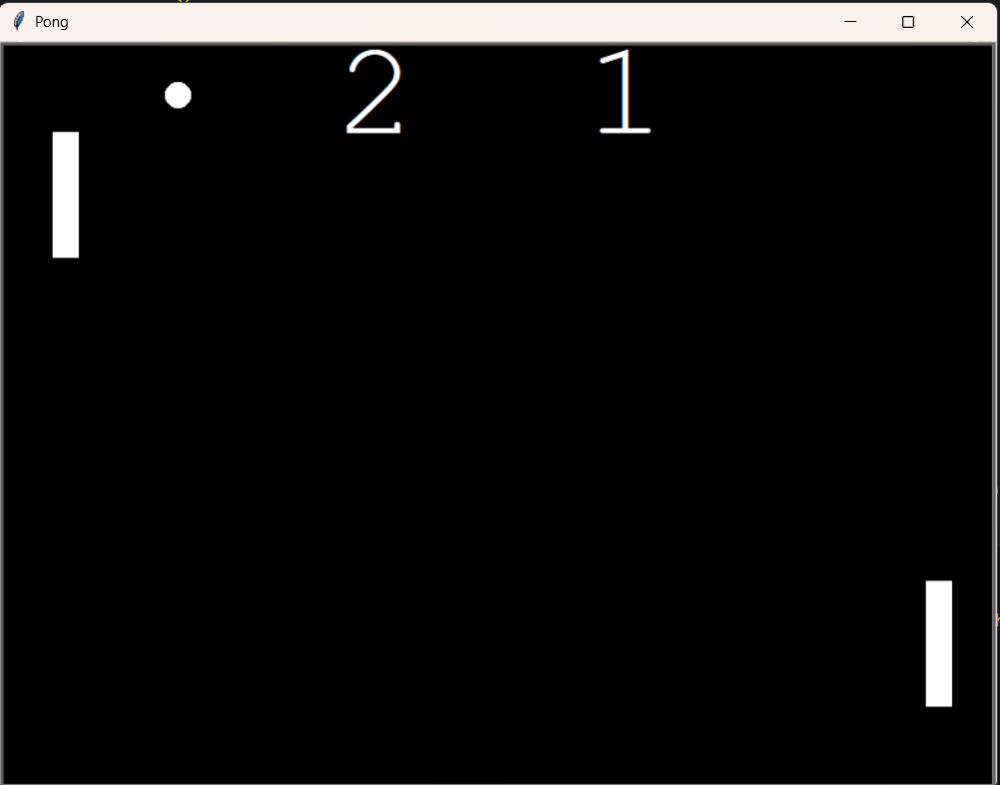

# 🏓 Pong Game (Python Turtle) #

A simple Pong game built using Python’s built-in turtle graphics module.    
This project recreates the classic Pong arcade game with smooth paddle movement, ball physics, scoring, and collision handling.

---

## Demo ##


## 🚀 Features ##

* Two-player Pong game
* Smooth paddle movement
* Ball speed increases on paddle bounce
* Scoreboard for both players
* Wall bounce detection
* Paddle collision detection
* Automatic ball reset after scoring
* Clean and object-oriented code (Paddle, Ball, Scoreboard)

---

## 🖥️ How to Play ##

### Right Paddle (Player 1): ###

* ⬆️ Up Arrow → Move up
* ⬇️ Down Arrow → Move down

### Left Paddle (Player 2): ###

* W → Move up
* S → Move down

### Your goal: ###
* Prevent the ball from crossing your side of the screen.
* When your opponent misses, you score a point.

---

## 🛠️ Requirements ##

This game uses Python’s built-in turtle module, so no external libraries are required.  
Make sure you have:  
Python 3.7+   
A desktop environment that supports the Turtle graphics window   

---

## ▶️ How to Run ##
1. Clone this repository:
   ```bash
   git clone https://github.com/HarshCh16/Pong-game
   ```
2. Navigate to the project folder:
   ```bash
    cd Pong-game
   ```
3. Run the game:
   ```bash
    python main.py
   ```
The game window will open and start instantly.

---

## 🧠 Concepts Used ##
* Object-Oriented Programming (Classes & Inheritance)
* Collision detection
* Screen updates using tracer() and update()
* Keyboard event handling
* Game loops with dynamic timing (time.sleep())

---
